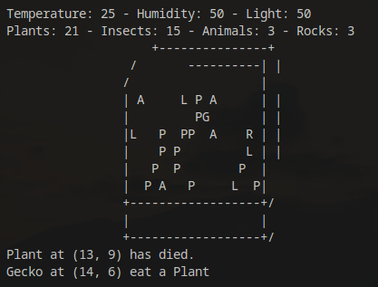

# Terrarium Simulator 🌿


This is a Python program that simulates a terrarium containing plants, insects, animals, and rocks. The program uses object-oriented programming concepts to represent each object in the terrarium as an instance of a Python class. The objects interact with each other by moving, eating, reproducing, and dying. The simulation also features weather events that can affect the terrarium's temperature, humidity, and light.

To make the simulation more realistic, the code uses threading to allow multiple objects to move simultaneously. This is done by creating a separate thread for each object and running the simulation loop on all threads concurrently. The threading module in Python allows for running multiple threads in parallel, which can improve the performance and speed of the simulation.

### Usage

```python
python simulator.py
```

## Dependencies 💻
The program requires **Python 3** to run. There are no external dependencies.

## Organisms 🐞

### Plants
Plants are represented by the `Plant` class. They do not move and can only reproduce asexually by creating a copy of themselves.

### Insects
Insects are represented by the `Insect` class. They move around the terrarium and can eat plants and other insects. There are two types of insects in the simulation: Ant and Ladybug.

### Animals
Animals are represented by the `Animal` class. They move around the terrarium and can eat plants and other animals. They can also reproduce sexually with other animals of the same size. There is only one type of animal in the simulation: Gecko.

### Rocks
Rocks are represented by the `Rock` class. They do not move and have no interactions with other objects in the terrarium.

## Movements 🏃
For the movements, the code uses different methods for each type of object. For instance, the Ant moves in the direction of its velocity components, while the Gecko moves randomly in one of the four cardinal directions. Additionally, objects can bounce off the walls of the terrarium to avoid going out of bounds.

The movement of objects is important because it allows them to interact with other objects in the ecosystem. For example, Ants can eat Plants, and Ladybugs can eat Insects and other Animals. In addition, Animals and Insects can reproduce with other objects of the same type, which leads to the creation of new offspring. These interactions make the simulation dynamic and exciting to watch.

## Distances 👁️
The distance between two objects in the terrarium is calculated using the Euclidean distance formula.

Eating/Reproduction
Plants can be eaten by insects and animals. Insects and animals can also eat each other, but only if the size of the eaten object is smaller than the size of the eater. Animals can reproduce sexually with other animals of the same size.

## Art 🎨
The code generates an ASCII art representation of the terrarium, with each organism represented by a letter: P for plants, A for ants, L for ladybugs, G for geckos, and R for rocks. The art is updated every iteration of the simulation.


The simulation will start and will run indefinitely until interrupted. To stop the simulation, press Ctrl+C.

You can also create your own Animals/Insects and change the quantity, its up to you! 😊